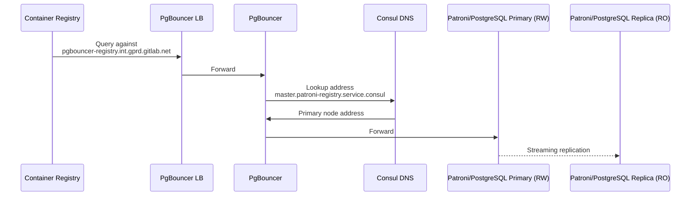
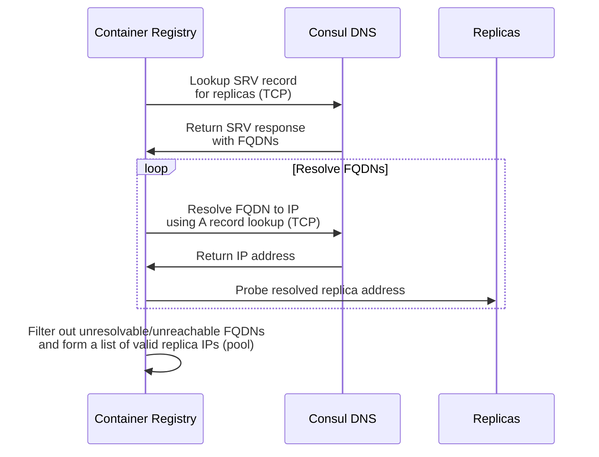
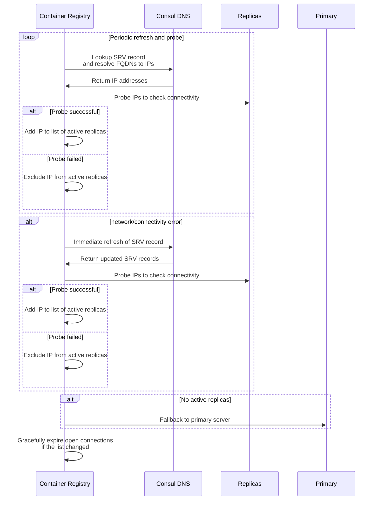
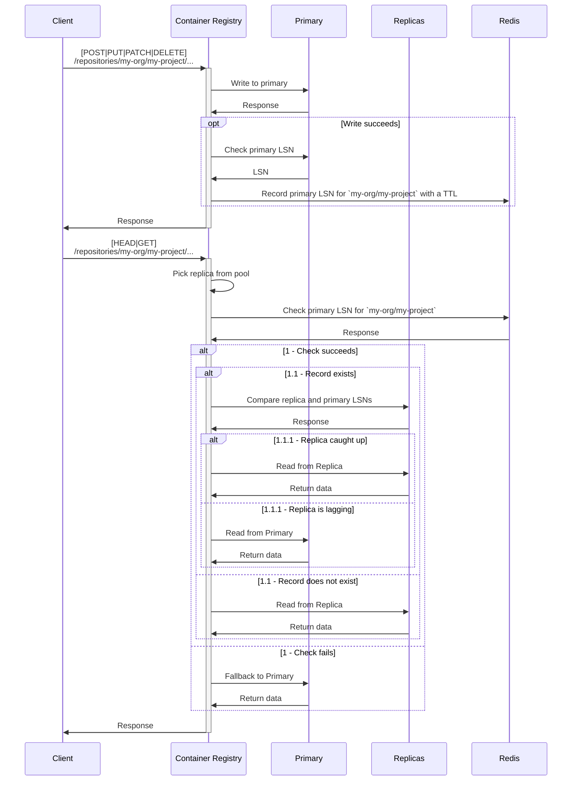
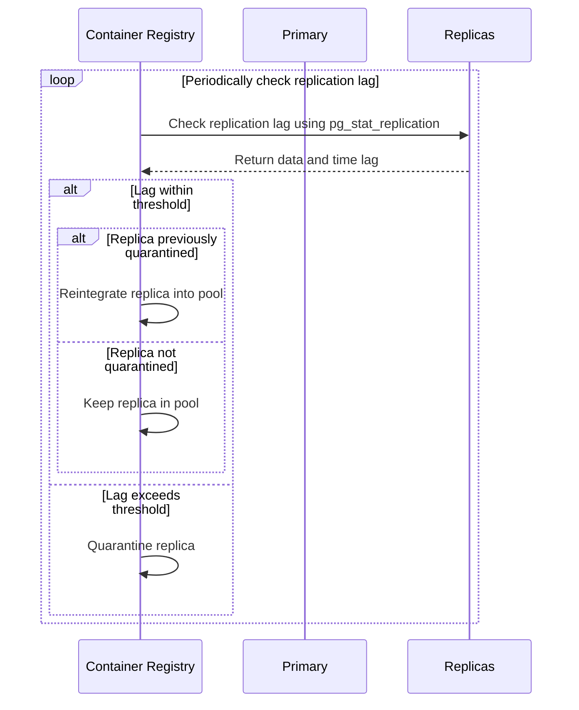

# Database Load Balancing

At GitLab, ensuring high availability, fault tolerance, and efficient resource utilization is paramount. Database Load Balancing (DLB) is crucial to address these challenges for services with a database (DB) backend by actively distributing queries across multiple backend hosts.

This document is the technical specification for how we aim to implement DLB for the container registry.

## Background

### Architecture

On GitLab.com, the registry has an independent PostgreSQL cluster composed of several components:

- [PostgreSQL](https://www.postgresql.org/): Database system;
- [Patroni](https://github.com/zalando/patroni): Replication system for High Availability (HA);
- [Consul](https://www.consul.io/): Distributed Configuration Store (DCS) to record the cluster topology;
- [PgBouncer](https://www.pgbouncer.org/): Connection pooler for PostgreSQL servers;
- [PgBouncer Load Balancer (LB)](https://cloud.google.com/load-balancing): A Google Cloud Load Balancer instance in front of PgBouncer nodes.

The following diagram illustrates the interaction between the registry application and these components:



By looking at the above, we can see that all registry requests are currently directed to the primary (read/write capable) node. The registry is configured to connect to `pgbouncer-registry.int.gprd.gitlab.net` ([source](https://gitlab.com/gitlab-com/gl-infra/k8s-workloads/gitlab-com/-/blob/e1813393ecf89b2d38866569cbf45b4470ee9183/releases/gitlab/values/gprd.yaml.gotmpl#L94)), which resolves to `master.patroni-registry.service.consul` ([source](https://gitlab.com/gitlab-com/gl-infra/k8s-workloads/gitlab-com/-/blob/e1813393ecf89b2d38866569cbf45b4470ee9183/releases/gitlab/values/gprd.yaml.gotmpl#L107)), which in turn resolves to the IP address of the primary PostgreSQL server.

`*.service.consul` are DNS records stored in Consul and served by [Consul DNS](https://developer.hashicorp.com/consul/docs/services/discovery/dns-overview#consul-dns). The `master.patroni-registry.service.consul` record is kept up to date with the address of the *current* primary node at any given time. That is, we don't need to keep track of the actual leader IP address in the event of a failover, that is a task for Patroni.

Aside from the primary/leader node, there is one *online* (available for read-only requests) replica node, and other *offline* replicas (delayed replication and recovery).

As with the primary node, there is a Consul DNS record (`registry-db-replica.service.consul`) that resolves to the list of currently active replica nodes.

### Motivation

As highlighted above, all DB queries are currently directed to the primary node. This was the path of least resistance when we first released the metadata DB, and the load since then has not been a concern. However, this is starting to change now that we have released more features that rely on the metadata DB, especially those that involve the processing of heavy queries, such as for storage usage calculations.

DLB is therefore slowly evolving from a nice-to-have to a must-have in terms of scalability. Using GitLab.com metrics as source, **~95%** of the registry API usage are **read requests** ([source](https://thanos.gitlab.net/graph?g0.expr=(sum(%0A%20%20%20%20rate(%0A%20%20%20%20%20%20registry_http_requests_total%7B%0A%20%20%20%20%20%20%20%20env%3D%22gprd%22%2C%0A%20%20%20%20%20%20%20%20method%3D~%22put%7Cpatch%7Cpost%7Cdelete%22%2C%0A%20%20%20%20%20%20%20%20code%3D~%22%5E2.*%7C404%22%0A%20%20%20%20%20%20%7D%5B6h%5D%0A%20%20%20%20)%0A)%0A%2F%20%0Asum(%0A%20%20%20%20rate(%0A%20%20%20%20%20%20registry_http_requests_total%7B%0A%20%20%20%20%20%20%20%20env%3D%22gprd%22%2C%0A%20%20%20%20%20%20%20%20method!%3D%22options%22%2C%0A%20%20%20%20%20%20%20%20code%3D~%22%5E2.*%7C307%7C404%22%0A%20%20%20%20%20%20%7D%5B6h%5D%0A%20%20%20%20)%0A))%20*%20100&g0.tab=1&g0.stacked=0&g0.range_input=1h&g0.max_source_resolution=0s&g0.deduplicate=1&g0.partial_response=0&g0.store_matches=%5B%5D)).

The disproportionately high read rate makes it a prime candidate for DLB:

- In case of a primary DB failure, we'll be able to continue serving the *vast majority* of the traffic by directing it to a read-only replica;
- We'll be able to drastically reduce the load on the primary *and* significantly reduce the saturation from heavy operations by diluting the toll across the pool of replica nodes.

Due to the above, we're now working on [Container Registry: Active database load balancing](https://gitlab.com/groups/gitlab-org/-/epics/8591), and this specification intends to pave the way for its implementation.

## Goals

Ensure efficient utilization of database resources, enhanced fault tolerance, and improved system performance and reliability, based on:

- **Service discovery:** Identify the list of replica addresses at any given time using DNS lookups against a configured name server. Allow bypassing service discovery to facilitate development and testing by providing a fixed list of hosts;

- **Fault tolerance:** Periodically refresh the list of resolved replica addresses. Immediately refresh the list in case of a network/connectivity error. Gracefully expire open connections if the list changes, and fallback to the primary server if replicas are unavailable;

- **Traffic splitting:** Route read/write operations to the primary node, and read-only operations to replica nodes;

- **Load distribution:** Evenly distribute the load across the pool of replica nodes using a round-robin algorithm;

- **Replication lag awareness:** Periodically check replication lag across replica nodes. Quarantine specific nodes whenever the measured lag goes beyond the configured thresholds;

- **Primary sticking:** To avoid stale reads, stick to the primary for serving all requests for a given target repository while replicas are catching up on replication;

- **Observability:** Provide ample visibility over the DLB operation. This includes log entries for all relevant events, Prometheus metrics and health checks;

- **GitLab.com first:** Our primary goal is to address the scalability and resource saturation concerns on GitLab.com. The proposed design will therefore focus on the GitLab.com architecture and the tools at our disposal. However, we will do so not by reinventing the wheel, but rather by targeting the minimum required subset of the DLB features (and configuration settings) that exist for the main GitLab database. By doing so, we guarantee forward compatibility.

We'll expand on some of these goals (those that require additional details) in the [Solution](#solution) section.

### Out of Scope

While most of these represent valuable features and improvements, they are out of scope for the very first iteration for the sake of simplicity:

- **Direct address discovery using `A` records:** We'll start by supporting only `SRV` DNS records. Internally, the solution will be able to resolve the FQDNs returned by an `SRV` lookup response using `A` record lookups, but configuring the feature with an `A` record directly won't be supported. `SRV` records are what we currently use for all the DLB settings on GitLab.com ([source](https://gitlab.com/gitlab-com/gl-infra/k8s-workloads/gitlab-com/-/blob/96143a01ac45f3e1a4af9b1f0d35308d93a9cfd7/releases/gitlab/values/gprd.yaml.gotmpl#L1984)). So there won't be an option to select the record type (`SRV` or `A`);

- **DNS lookups through UDP:** We'll start by supporting DNS lookups only through TCP. We currently only use TCP on GitLab.com ([source](https://gitlab.com/gitlab-com/gl-infra/k8s-workloads/gitlab-com/-/blob/96143a01ac45f3e1a4af9b1f0d35308d93a9cfd7/releases/gitlab/values/gprd.yaml.gotmpl#L1986)). So there won't be an option to select the protocol (TCP or UDP);

- **Pool size limits:** Limits to the size of replicas in a pool. We currently have a stable and small pool size on GitLab.com, rendering this feature unnecessary for now;

- **Weight and priority load balancing:** `SRV` records have Priority and Weight properties ([RFC 2782](https://datatracker.ietf.org/doc/html/rfc2782)). Priority determines the order of the target (lower is preferred), while weight is used for load balancing among targets with the same priority (higher is favored). We'll ignore these and simply rely on a round-robin algorithm for load balancing. This is similar to how it's done for the main DB;

- **Support for prepared statements:** These are not compatible with the DLB strategy due to session state dependencies, as they are bound to the duration of a database session ([source](https://www.postgresql.org/docs/current/sql-prepare.html)). We already disable these by default for compatibility with PgBouncer ([docs](https://gitlab.com/gitlab-org/container-registry/-/blob/c9a093fb0d64c0ba3a56c626129e084b98488e1d/docs/configuration.md#database)), so we should enforce it to be disabled when using DLB;

- **Per-query traffic split:** In an ideal world, traffic would be split on a per-query basis. That is, if a given API request requires 10 queries, but only 3 of those require read/write capabilities, we'd route the 7 read-only queries to replica nodes and the remaining 3 to the primary node. More about this in [Traffic Splitting and Load Distribution](#traffic-splitting-and-load-distribution);

- **Centralized replication lag monitoring:** Ideally, there would be only one registry instance monitoring the replication lag of DB replicas across the whole fleet. The information would then be recorded centrally (Redis) for other instances to consume. For the sake of simplicity, and to avoid a single point of failure, in the first iteration the monitoring will be performed locally in each registry instance;

- **Relative replication lag quarantine:** Selectively routing read requests to quarantined replicas based on their individual replication lag _relative_ to the last write activity of the target repository (see [Primary Sticking](#primary-sticking) for context) would allow us to improve resource utilization during periods of high write activity. However, this represents additional complexity and not including this in the scope for the first iteration does not leave us in a situation worse than we currently are (routing all traffic to the primary);

- **Online garbage collection (GC):** Although [Online GC](online-garbage-collection.md) requires both read and write database operations, it will continue to use the primary exclusively. GC queries occur mostly within transactions, and these require a read/write DB connection regardless. Even if/when that's not the case, online GC is a highly time-sensitive process, which should be guarded against replication lag at all cost.

## Solution

### Configuration

We'll need to add new configuration settings to support DLB. These should be located in a new `loadbalancing` section, under the existing `database` root section:

```yaml
database:
  loadbalancing:
    hosts:
      - secondary1.example.com
      - secondary2.example.com
    nameserver: localhost
    port: 8600
    record: db-replica-registry.service.consul
    replicacheckinterval: 1m
```

| Parameter              | Required | Description                                                                                                                                                                                                    | Default          |
|------------------------|----------|----------------------------------------------------------------------------------------------------------------------------------------------------------------------------------------------------------------|------------------|
| `hosts`                | No       | A static list of host to use for load balancing. Can be used as an alternative to service discovery. Ignored if `record` is set. These hosts must be reachable on the same port configured in `database.port`. |                  |
| `nameserver`           | No       | The nameserver to use for looking up the DNS record.                                                                                                                                                           | `localhost`      |
| `port`                 | No       | The port of the nameserver.                                                                                                                                                                                    | `8600`           |
| `record`               | Yes      | The `SRV` record to look up. This option is required for service discovery to work.                                                                                                                            |                  |
| `replicacheckinterval` | No       | The minimum amount of time between checking the status of a replica.                                                                                                                                           | `1m`             |

We'll refer to each of these configuration parameters and their purpose in the following sections.

### Service Discovery

To implement service discovery, the Container Registry will:

- Identify the list of replica addresses by resolving the configured [`SRV`](https://www.cloudflare.com/en-gb/learning/dns/dns-records/dns-srv-record/) `record` in a `nameserver`. While for GitLab.com the DNS records exist in Consul, the solution won't leverage any Consul-specific API or client tools. The implementation should be agnostic and use standard DNS lookup network requests against the configured `nameserver:port`;
  
- Ignore and exclude target replica from pool in case the corresponding FQDN returned from the `SRV` response can't be resolved to an IP address (through the intermediate `A` record lookup).

The following diagram illustrates the service discovery process:



See [RFC 2782](https://datatracker.ietf.org/doc/html/rfc2782) for more details about `SRV` lookups.

### Fault Tolerance

To ensure fault tolerance, the Container Registry will:

- Periodically (`replicacheckinterval`) refresh the list of resolved replica addresses asynchronously to maintain up-to-date information;

- Trigger an immediate refresh of the replica list in case of network/connectivity errors, as these might indicate events such as a cluster failover;

- Gracefully expire open connections if the list of hosts changes, ensuring that stale connections are closed;

- Fallback to the primary server if all replicas are unavailable or unresponsive. This also relates to [Primary Sticking](#primary-sticking);

- Quarantine replicas that exhibit connectivity issues to prevent cascading failures and flapping behavior:
  - **Consecutive failure tracking**: A replica is quarantined after 3 consecutive connectivity failures during connection attempts;
  - **Flapping detection**: A replica is quarantined if it is added/removed from the pool 5 or more times within a 60-second sliding window, indicating unstable connectivity;
  - **Auto-reintegration**: Quarantined replicas are automatically reintegrated after a 5-minute quarantine period, allowing recovery from transient issues.

The following diagram illustrates the fault tolerance process:



### Primary Sticking

To avoid stale reads, the Container Registry will:

- After a successful API write request for repository `R`, check the [Log Sequence Number (LSN)](https://www.postgresql.org/docs/14/wal-internals.html) for the Primary ([`pg_current_wal_insert_lsn`](https://www.postgresql.org/docs/14/functions-admin.html#FUNCTIONS-ADMIN-BACKUP)) and conditionally update it in Redis, associated with `R` with a TTL.

  The LSN represents the current write-ahead log (WAL) insert location, and can be used to determine if and how far apart primary and replicas are in terms of data replication.

  This strategy leverages the fact that the target repository path is part of every write API request's path. Therefore, it's possible to univocally determine the target repository for each write request.

  The comparison and conditional update of LSN records in Redis is done atomically using a Lua script to avoid race conditions. LSNs in PostgreSQL are represented as `X/Y` strings, where `X` is the major part (higher order bits) and `Y` is the minor part (lower order bits) in hexadecimal. For proper comparison, the script converts both the current and new LSNs into 64-bit numeric values before comparing them, and only updates if the new LSN is greater or new.

- When serving an API read request for `R`, check the LSN of the candidate replica ([`pg_last_wal_replay_lsn`](https://www.postgresql.org/docs/14/functions-admin.html#FUNCTIONS-ADMIN-BACKUP)) and compare it ([`pg_wal_lsn_diff`](https://www.postgresql.org/docs/14/functions-admin.html#FUNCTIONS-ADMIN-BACKUP)) with the previously recorded primary LSN for `R`. This can be done in a single query against the replica.

  If the record does not exist in Redis, the request should be served by the replica.

  If the record exists, and the comparison returns a positive number, the candidate replica is lagging, and the request should be served by the primary. Otherwise, the replica has caught up (in the context of `R`) and read queries can be safely served from it.

- Gracefully fallback to Primary in case of a failure or timeout during the described Redis operations.

The following diagram illustrates this process:



Ideally, to avoid unnecessary LSN comparisons against replicas, we would keep track of which ones are lagging for a given repository and delete the corresponding primary LSN record as soon as all of them have caught up. In step 1.1.1, if a given replica had caught up, the registry could asynchronously check the LSN difference for all the remaining replicas and delete the record from Redis if (and only if) all of them had caught up too. However, this represents an additional layer of complexity that we can live without on a first iteration.

Given the above, we will start by applying a fixed TTL of 1 hour to the primary LSN records for each repository in Redis. In the future, the same TTL (maybe with a different duration) will remain in place to shield us from failures in the asynchronous check *or* cases where a repository had no reads for a really long period since the last write. These edge cases could lead to stale records in Redis or unnecessary LSN comparisons.

Primary sticking is not available for [GitLab API](#gitlab-api) endpoints that target multiple repositories, such as
size measurement requests. In order to determine if a replica is up to date for one of these requests, we would have to
keep track of LSNs for not just a single leaf repository (the request target) but for the root and intermediate
repositories as well. This would be fairly complex and resource intensive, with little to no added benefit. For example,
for size measurement requests, Rails buffers/deduplicates size refreshes for groups and namespaces to reduce load.
Therefore, there is little to no benefit in always providing the most up-to-date value (from primary) for this
endpoint, and a trailing value during high replication lag is an acceptable compromise given its high resource usage.

#### Redis

This process will produce a noticeable Redis load:

- One [`SET`](https://redis.io/docs/latest/commands/set/) command for each _successful_ `POST`, `PUT`, `PATCH`, and `DELETE` API request across all endpoints. Estimate of ~60 per second on GitLab.com ([source](https://thanos.gitlab.net/graph?g0.expr=sum(%0A%20%20%20%20rate(%0A%20%20%20%20%20%20registry_http_requests_total%7B%0A%20%20%20%20%20%20%20%20env%3D%22gprd%22%2C%0A%20%20%20%20%20%20%20%20method%3D~%22put%7Cpatch%7Cpost%7Cdelete%22%2C%0A%20%20%20%20%20%20%20%20code%3D~%22%5E2.*%22%0A%20%20%20%20%20%20%7D%5B1d%5D%0A%20%20%20%20)%0A)&g0.tab=1&g0.stacked=0&g0.range_input=1h&g0.max_source_resolution=0s&g0.deduplicate=1&g0.partial_response=0&g0.store_matches=%5B%5D&g0.end_input=2024-05-22%2000%3A00%3A00&g0.moment_input=2024-05-22%2000%3A00%3A00));
- One [`GET`](https://redis.io/docs/latest/commands/get/) command for each `HEAD` and `GET` API request on eligible endpoints. Estimate of ~1500 per second on GitLab.com ([source](https://thanos.gitlab.net/graph?g0.expr=sum(%0A%20%20%20%20rate(%0A%20%20%20%20%20%20registry_http_requests_total%7B%0A%20%20%20%20%20%20%20%20env%3D%22gprd%22%2C%0A%20%20%20%20%20%20%20%20method%3D~%22get%7Chead%22%2C%0A%20%20%20%20%20%20%20%20code!~%22401%7C405%22%2C%0A%20%20%20%20%20%20%20%20route!~%22%5E%2Fv2%2F%24%22%0A%20%20%20%20%20%20%7D%5B1d%5D%0A%20%20%20%20)%0A)&g0.tab=1&g0.stacked=0&g0.range_input=1h&g0.max_source_resolution=0s&g0.deduplicate=1&g0.partial_response=0&g0.store_matches=%5B%5D&g0.end_input=2024-05-22%2000%3A00%3A00&g0.moment_input=2024-05-22%2000%3A00%3A00)).

On GitLab.com, at the time of writing, the registry has a single Redis Sentinel deployment for caching purposes. There is an ongoing effort to provision a new Redis Cluster dedicated to rate limiting ([source](https://gitlab.com/groups/gitlab-com/gl-infra/-/epics/1312)). Ideally, for isolation and reliability reasons (beyond performance), this specific use case should be handled by a new Redis Cluster dedicated to load balancing. This strategy aligns with the original vision/justification for Redis that was [described and discussed with Infrastructure](https://gitlab.com/gitlab-com/gl-infra/scalability/-/issues/1708).

### Traffic Splitting and Load Distribution

To efficiently manage database load and improve performance, the Container Registry will:

- Direct all write operations to the primary PostgreSQL node to ensure data consistency and integrity;

- Split read operations based on recent write activity (see [Primary Sticking](#primary-sticking) for more details):
  - If a recent write operation has occurred for the target repository, read requests will be directed to the primary node to avoid stale data;
  - If no recent write operation has been recorded, read requests will be distributed among the available replica nodes;

- Use a round-robin algorithm to evenly distribute read operations across the available replica pool;

- Only include and maintain replicas that are available and meet the replication lag criteria in the pool.

#### API Request Split

As highlighted in [Out of Scope](#out-of-scope), for the sake of simplicity, the first version won't perform any per-query traffic split but rather per-API request traffic split. Per-query splitting would make the process more complex (implementation constraints) and error-prone (e.g., replication lag) right out of the gate. Therefore, for a given API request, the registry determines if any write operation is necessary, and if so, routes all queries in the scope of that request to the primary node.

##### GitLab API

The table below lists all the operations of our [custom API](api.md) that the registry implements. For each operation, it mentions the target (Primary or Replicas) that will be used for incoming requests and the type of queries involved (read and/or write):

| Method  | Endpoint                                                | Target   | Read | Write | Observations                                                                                               |
| ------- | ------------------------------------------------------- | -------- | ---- | ----- | ---------------------------------------------------------------------------------------------------------- |
| `GET`   | `/gitlab/v1/`                                           | N/A      | N/A  | N/A   |                                                                                                            |
| `GET`   | `/gitlab/v1/repositories/<path>/`                       | Replicas | Yes  | No    | This endpoint includes functionality for storage usage calculations - the most CPU-intensive DB operation. |
| `PATCH` | `/gitlab/v1/repositories/<path>/`                       | Primary  | Yes  | Yes   |                                                                                                            |
| `GET`   | `/gitlab/v1/repositories/<path>/tags/list/`             | Replicas | Yes  | No    | One of the most heavily used API operations (listing tags in the GitLab Rails frontend and backend).       |
| `GET`   | `/gitlab/v1/repository-paths/<path>/repositories/list/` | Replicas | Yes  | No    |                                                                                                            |

##### OCI Distribution API

The table below lists all the operations of the standard [OCI Distribution API](https://github.com/opencontainers/distribution-spec/blob/main/spec.md) that the registry implements. For each operation, it mentions the target (Primary or Replicas) that will be used for incoming requests and the type of queries involved (read and/or write):

| Method         | Endpoint                               | Target   | Read | Write | Observations                                                                                                                                                                              |
| -------------- | -------------------------------------- | -------- | ---- | ----- | ----------------------------------------------------------------------------------------------------------------------------------------------------------------------------------------- |
| `GET`          | `/v2/`                                 | N/A      | N/A  | N/A   |                                                                                                                                                                                           |
| `GET` / `HEAD` | `/v2/<name>/blobs/<digest>`            | Replicas | Yes  | No    |                                                                                                                                                                                           |
| `DELETE`       | `/v2/<name>/blobs/<digest>`            | Primary  | Yes  | Yes   |                                                                                                                                                                                           |
| `GET`          | `/v2/<name>/blobs/uploads/<reference>` | N/A | N/A | N/A | Does not require database interactions. Uploads are [currently](https://gitlab.com/gitlab-org/container-registry/-/issues/427) tracked using the filesystem metadata only. |
| `POST`         | `/v2/<name>/blobs/uploads/`            | Primary  | Yes  | Yes   |                                                                                                                                                                                           |
| `PATCH`        | `/v2/<name>/blobs/uploads/<reference>` | N/A | N/A | N/A | Does not require database interactions. Uploads are [currently](https://gitlab.com/gitlab-org/container-registry/-/issues/427) tracked using the filesystem metadata only. |
| `PUT`          | `/v2/<name>/blobs/uploads/<reference>` | Primary  | Yes  | Yes   |                                                                                                                                                                                           |
| `GET` / `HEAD` | `/v2/<name>/manifests/<reference>`     | Replicas | Yes  | No    |                                                                                                                                                                                           |
| `PUT`          | `/v2/<name>/manifests/<reference>`     | Primary  | Yes  | Yes   |                                                                                                                                                                                           |
| `DELETE`       | `/v2/<name>/manifests/<reference>`     | Primary  | Yes  | Yes   |                                                                                                                                                                                           |
| `GET`          | `/v2/<name>/tags/list`                 | Replicas | Yes  | No    |                                                                                                                                                                                           |

### Replication Lag

To avoid stale reads, the Container Registry will:

- Periodically check replication lag across replica nodes asynchronously (`replicacheckinterval`) and record the results locally;
- Monitor both data (bytes) and time (seconds) lag. The [`pg_stat_replication`](https://www.postgresql.org/docs/14/monitoring-stats.html#MONITORING-PG-STAT-REPLICATION-VIEW) system view offers insight into both of these metrics at runtime. See [this article](https://www.cybertec-postgresql.com/en/monitoring-postgresql-replication/) for more details;
- Quarantine a node whenever (and for as long as) the measured lag goes beyond the configured thresholds (`maxreplicalagbytes` and `maxreplicalagtime`).

The following diagram illustrates the replication lag monitoring process:



### Observability

To ensure transparency and provide operational insights, the Container Registry will implement observability features for the DLB mechanism. These include detailed logging and Prometheus metrics, as well as health check.

#### Logging

The Container Registry will generate log entries for each of the following events:

- DNS lookups, including resolved addresses and success or failure status;
- Changes to the replica list;
- Expiry of open connections when the replica list changes;
- Replica added to or removed from the pool based on DNS lookup and probing results;
- Replica connectivity failures and successes during connection attempts;
- Pool events (replica add/remove) tracked for flapping detection;
- Replica quarantined due to connectivity issues (consecutive failures or flapping behavior);
- Quarantined replica reintegrated into the pool after connectivity quarantine period expires;
- Periodic replication lag checks, indicating the lag values for each replica. Part of [Phase 2](https://gitlab.com/groups/gitlab-org/-/epics/8591#phase-2);
- Replica quarantined due to exceeding the lag thresholds. Part of [Phase 2](https://gitlab.com/groups/gitlab-org/-/epics/8591#phase-2);
- Quarantined replica reintegrated into the pool after catching up on replication lag. Part of [Phase 2](https://gitlab.com/groups/gitlab-org/-/epics/8591#phase-2);
- Tracking of write operation for each repository in Redis;
- Read operations, indicating whether the query was routed to the primary or a replica (and which one) and why (e.g. routed to primary due to sticking; routed to replica due to round-robin election). Due to volume, these entries should carry the `DEBUG` log level;
- Fallbacks of read requests to the primary or a different replica due to the unavailability of replicas.

#### Metrics

The Container Registry will export the following Prometheus metrics:

| Metric Name                                                 | Type      | Description                                                                                                                                                                                                                                                                                                                                                        |
|-------------------------------------------------------------|-----------|--------------------------------------------------------------------------------------------------------------------------------------------------------------------------------------------------------------------------------------------------------------------------------------------------------------------------------------------------------------------|
| `registry_database_lb_lookup_duration_seconds`              | Histogram | Histogram of latencies for DNS lookups. `error=<true/false>` and `lookup_type=<srv/host>` labels.                                                                                                                                                                                                                                                                  |
| `registry_database_lb_pool_size`                            | Gauge     | Current number of replicas in the pool.                                                                                                                                                                                                                                                                                                                            |
| `registry_database_lb_pool_status`                          | Gauge     | Status of each replica in the pool. `replica` and `status=<online/quarantined>` labels. Part of [Phase 2](https://gitlab.com/groups/gitlab-org/-/epics/8591#phase-2).                                                                                                                                                                                              |
| `registry_database_lb_pool_events_total`                    | Counter   | Number of replicas added (`event=replica_added`, `reason=discovered`) to the pool or removed (`event=replica_removed`, `reason=removed_from_dns`) based on DNS lookup and probing results. <br />Number of replicas quarantined (`event=replica_quarantined`) or reintegrated (`event=replica_reintegrated`) with `reason=<replication_lag\|connectivity>` label to distinguish between lag-based quarantine (part of [Phase 2](https://gitlab.com/groups/gitlab-org/-/epics/8591#phase-2)) and connectivity-based quarantine (consecutive failures or flapping detection). |
| `registry_database_lb_lag_bytes`                            | Gauge     | Replication lag in bytes for each replica (identified by a `replica` label). Part of [Phase 2](https://gitlab.com/groups/gitlab-org/-/epics/8591#phase-2).                                                                                                                                                                                                         |
| `registry_database_lb_lag_seconds`                          | Histogram | Replication lag in seconds for each replica (identified by a `replica` label). Part of [Phase 2](https://gitlab.com/groups/gitlab-org/-/epics/8591#phase-2).                                                                                                                                                                                                       |
| `registry_database_lb_targets_total`                        | Counter   | A counter for primary and replica target elections during database load balancing. `target_type=<primary/replica>`, `fallback=<true/false>`, and `reason=<selected/no_cache/no_replica/error/not_up_to_date>` labels.                                                                                                                                              |
| `registry_database_lb_expired_total`                        | Counter   | Number of expired connections due to changes in the replica list. Part of [Phase 2](https://gitlab.com/groups/gitlab-org/-/epics/8591#phase-2).                                                                                                                                                                                                                    |
| `registry_database_lb_lsn_cache_operation_duration_seconds` | Histogram | Duration of LSN cache set/get operations. `operation=<set/get>`, `error=<true/false>` labels.                                                                                                                                                                                                                                                                      |
| `registry_database_lb_lsn_cache_hits_total`                 | Counter   | Total number of LSN cache hits and misses. `result=<hit/miss>` label.                                                                                                                                                                                                                                                                                              |

#### Health Check

To ensure the health and availability of the database load balancing mechanism, the Container Registry [`/debug/health`](https://gitlab.com/gitlab-org/container-registry/-/blob/134bb3b2ed6c47466c107664d61097403850e64b/docs/configuration.md#health) endpoint will be extended to provide the following information:

- Overall status of the load balancing mechanism (healthy/unhealthy);
- List of currently active replicas in the pool, including their individual status (online/quarantined).

The health check endpoint will continue to return a HTTP status code of `200 OK` if the overall status is "healthy", and a `503 Service Unavailable` if the status is "unhealthy". This allows external monitoring systems to easily detect and alert on any issues with the load balancing mechanism.

## Rollout Plan

To minimize impact and risk while enabling faster iteration, this feature will be developed and rolled out in two sequential phases.

This feature will only be officially supported on self-managed instances once it has been fully rolled out on GitLab.com. A third phase may be used to coordinate this effort by then.

### Phase 1

- Minimal Viable Change (MVC) implementation. All documented features except:
  - [Active replication lag monitoring](#replication-lag);
  - [Immediate refresh of replicas list in case of network errors](#fault-tolerance);
  - [Health checking](#health-check).
- Implementation of the required Distribution (Helm Chart) changes;
- Rollout on GitLab.com, with only a single registry API endpoint utilizing load balancing. [Get repository details](https://gitlab.com/gitlab-org/container-registry/-/blob/master/docs/spec/gitlab/api.md?ref_type=heads#get-repository-details) is the selected endpoint for the following reasons:
  - Used to query storage usage per GitLab project/group/namespace, which is currently the slowest and most resource intensive query;
  - Lowest in risk and criticality. It is _not_ part of the image push/pull workflow and is only used internally to display repository details in the GitLab UI;
  - Low request rate ([source](https://dashboards.gitlab.net/goto/2ucSNn7Ng?orgId=1)).

- Rely on the existing Redis cache instance on GitLab.com for [primary sticking](#primary-sticking).

This phase allows us to see immediate improvements in primary resource saturation while safely deferring the implementation of some features and infrastructure changes to Phase 2.

This is being tracked in [Container Registry: DLB Phase 1 (&14105)](https://gitlab.com/groups/gitlab-org/-/epics/14105).

### Phase 2

- Provisioning and switch to a dedicated Redis Cluster for load balancing on GitLab.com;
- Implementation of all remaining features not delivered during Phase 1;
- Gradual rollout for the remaining API endpoints, sequentially and ordered by ascending criticality.

This is being tracked in [Container Registry: DLB Phase 2 (&15998)](https://gitlab.com/groups/gitlab-org/-/epics/15998).
