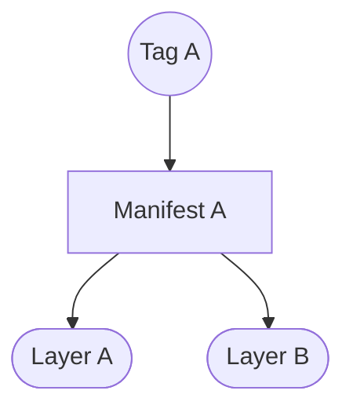
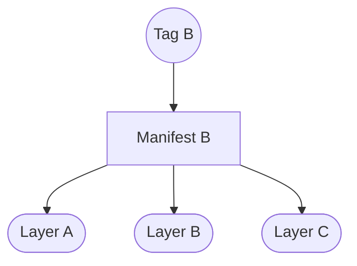
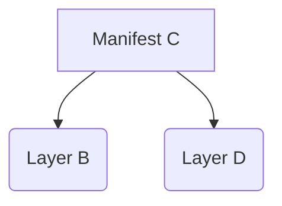
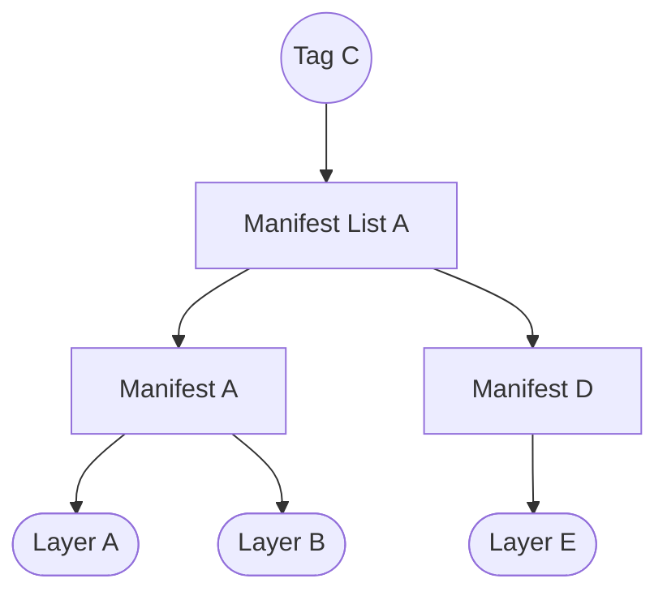
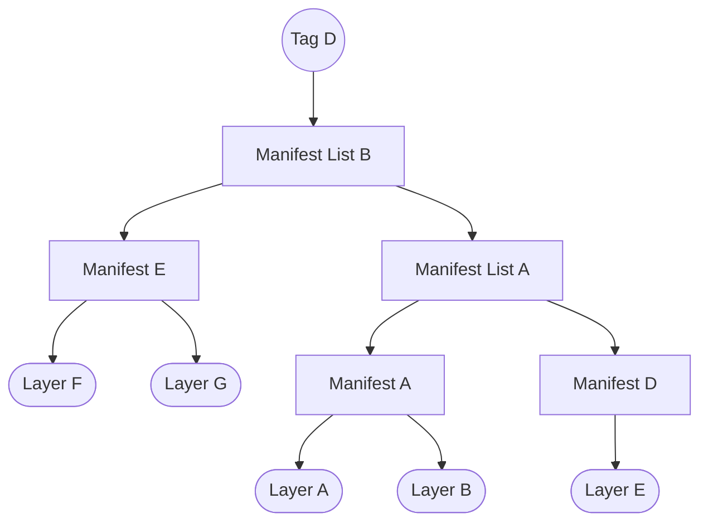

# Storage Usage

## Context

<!-- markdownlint-disable-next-line MD044 -->
In %14.6, and more precisely [gitlab-org/container-registry#493](https://gitlab.com/gitlab-org/container-registry/-/issues/493), we started working on a new feature to calculate the storage usage of repositories, and exposed it through the API. Before this, we had no visibility over the size of container repositories.

This document is intended to provide a technical summary of this feature as well as to document caveats and troubleshooting tips, all useful for registry engineers.

## Problem

Here is a visual explanation of how the deduplicated size of a _single_ repository should be calculated. All images described here are in the same repository.

We'll start with a tagged manifest with two layers:



Because `Manifest A` is tagged, we need to account for the size of `Layer A` and `Layer B` when calculating the size of the repository. So at this point, the size of the repository is `Layer A + Layer B`.

---

Another tagged manifest using the same two layers as `Manifest A` with an additional one:



Because multiple tagged manifests use `Layer A` and `Layer B`, we must only count them once, i.e., the size of the repository is not `(Layer A x 2) + (Layer B x 2) + Layer C` but instead `Layer A + Layer B + Layer C`.

---

Another manifest, but this time it is untagged.



`Manifest C` is untagged and, therefore, garbage collected (unless tagged or referenced in a list in between). So, despite having a new layer that we haven't seen so far (`Layer D`), the size of this layer doesn't count for calculating the size of the repository.

---

Now on to manifest lists:



The `Manifest List A` is tagged and references `Manifest A` and `Manifest B`. We have already accounted for `Layer A` and `Layer B` previously, so we should ignore them now. But there is also `Manifest D`. This manifest is not tagged but is referenced in this tagged manifest list, so we must account for `Layer E`.

Therefore, the repository size is `Layer A + Layer B + Layer C + Layer E`.

---

Manifest lists can also reference other manifest lists, and there is no depth limit:



We have another tagged manifest list. It references `Manifest List A`, which we already accounted for in `Tag C`. So we should ignore it. But then there is also `Manifest E`, which we haven't seen before. We must account for the layers referenced by it.

Therefore, the final repository size is `Layer A + Layer B + Layer C + Layer E + Layer F + Layer G`.

## Solution

The solution was to implement a database query, wrapped in a new API route, that can be used to efficiently and accurately calculate the deduplicated size of a given repository, taking into account all constraints described above.

While the problem statement above specifically mentions individual repositories, the logic applies for root (`foo`), intermediate (`foo/bar`) or leaf (`foo/bar/car`) repositories. The difference is that instead of limiting the calculation to the sum of all unique layers within a single repository, we may need to expand that across multiple repositories. So, if we want to know the deduplicated size of `foo/bar` and its descendants, we need to deduplicate the layers associated with `foo/bar`, `foo/bar/car` and any other repositories under `foo/bar/`.

The new API route is `GET /gitlab/v1/repositories/<path>/?size=[self|self_with_descendants]` and [is documented](spec/gitlab/api.md#get-repository-details). From there you can locate the related codebase and the currently used database queries.

## Caveats

### Extremely Large Namespaces

<!-- markdownlint-disable-next-line MD044 -->
In [gitlab-org&9415](https://gitlab.com/groups/gitlab-org/-/epics/9415) we've come to know that the database query used to measure the size of top-level namespaces was timining out for some on GitLab.com. Upon further analysis, we've identified that the affected namespaces were extremely large in size (terabytes). You can find all the relevant investigation details in the linked epic. In the end, we decided to move forward with a short-term mitigation change: [Fallback to alternative estimation method when measuring namespace usage](https://gitlab.com/gitlab-org/container-registry/-/issues/853).

## Troubleshooting

### Extremely Large Namespaces

<!-- markdownlint-disable-next-line MD044 -->
Despite the changes introduced in [gitlab-org/container-registry#853](https://gitlab.com/gitlab-org/container-registry/-/issues/853), the size estimation query is still not an universal solution (as expected), and there are a few namespaces for which the query still takes way more than 15 seconds (timeout) to execute, making it unfeasible to operate online.

However, for GitLab.com, in case we need to estimate the size of one of these repositories (either on-demand or for statistics purposes), we can do so manually using a production database replica with no configured timeouts. To do so, do the following:

1. Get access to a production database replica as [documented](ssh-access-for-debugging.md);
1. Start a transaction and disable statement timeouts within:

   ```sql
   begin;
   set local statement_timeout = 0;
   ```

1. Now execute the size estimation query for the target namespace. Here we're using `gitlab-org` as example:

   ```sql
   SELECT
       coalesce(sum(q.size), 0)
   FROM ( SELECT DISTINCT ON (digest)
           size
       FROM
           layers
       WHERE
           top_level_namespace_id = (
               SELECT
                   id
               FROM
                   top_level_namespaces
               WHERE
                   name = 'gitlab-org')) q;
   ```

1. The output of the query above is the estimated size in bytes.
